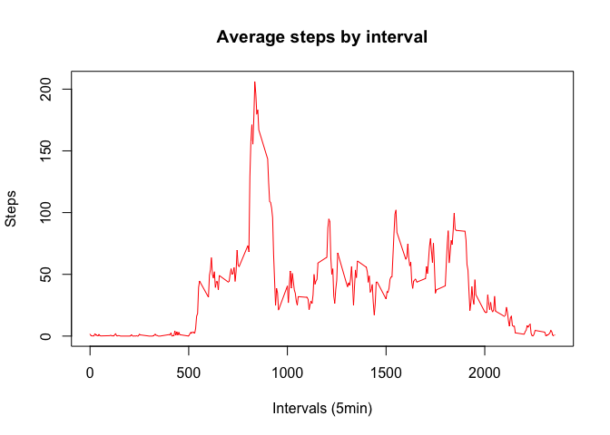

Course 5 - week 2 - Assignment
==============================

## Instructions
It is now possible to collect a large amount of data about personal movement using activity monitoring devices such as a Fitbit, Nike Fuelband, or Jawbone Up. These type of devices are part of the “quantified self” movement – a group of enthusiasts who take measurements about themselves regularly to improve their health, to find patterns in their behavior, or because they are tech geeks. But these data remain under-utilized both because the raw data are hard to obtain and there is a lack of statistical methods and software for processing and interpreting the data.

This assignment makes use of data from a personal activity monitoring device. This device collects data at 5 minute intervals through out the day. The data consists of two months of data from an anonymous individual collected during the months of October and November, 2012 and include the number of steps taken in 5 minute intervals each day.

The data for this assignment can be downloaded from the course web site:
Dataset: [Activity monitoring data](https://d396qusza40orc.cloudfront.net/repdata%2Fdata%2Factivity.zip) size: 52K
The variables included in this dataset are:

**steps**: Number of steps taking in a 5-minute interval (missing values are coded as 𝙽𝙰)
**date**: The date on which the measurement was taken in YYYY-MM-DD format
**interval**: Identifier for the 5-minute interval in which measurement was taken
The dataset is stored in a comma-separated-value (CSV) file and there are a total of 17,568 observations in this dataset.

## Data origin
The origin of the data is: [Activity monitoring data](https://d396qusza40orc.cloudfront.net/repdata%2Fdata%2Factivity.zip)
Size: 52K (2018-04-02 14:15:00)

## Data processing steps
1. Setting the environment & variables

```r
library(plyr, warn.conflicts = FALSE) 
library(dplyr, warn.conflicts = FALSE)
library(data.table, warn.conflicts = FALSE)
library(lattice, warn.conflicts = FALSE)
setwd("~/repos/Coursera/RepData_PeerAssessment1")
if (file.exists('./data')) unlink('./data', recursive = TRUE)
dir.create('./data')
```

2. Download & extract dataset

```r
download.file('https://d396qusza40orc.cloudfront.net/repdata%2Fdata%2Factivity.zip',
              destfile = 'dataset.zip',
              method = 'curl')

zipF <- list.files(path = "./", pattern = "dataset.zip", full.names = TRUE)
a<-ldply(.data = zipF, .fun = unzip, exdir = './data')
```


## Loading and preprocessing the data

```r
dat <- data.table(read.csv('data/activity.csv', header=TRUE))
dat$date <- as.Date(dat$date, format="%Y-%m-%d")
```


## What is mean total number of steps taken per day?

```r
tot <-aggregate(dat$steps, by=list(dat$date), FUN=sum)
setnames(tot, 'Group.1', 'date')
setnames(tot, 'x', 'steps')
hist(tot$steps, 
     main = "Daily steps", 
     xlab = 'Steps', 
     col = 'light blue')
```

<!-- -->

```r
totMean <- mean(tot$steps, na.rm=TRUE)
totMedian <- median(tot$steps, na.rm=TRUE)
```

Mean of total steps: 10766.19 steps  
Median of total steps: 10765.00 steps  
  
  

## What is the average daily activity pattern?

```r
tot1 <-aggregate(dat$steps, by=list(dat$interval), FUN=mean, na.rm=TRUE)
plot(tot1$Group.1, tot1$x, type='l', xlab='Intervals (5min)', ylab='Steps', main='Average steps by interval', col='red')
```

<!-- -->

```r
maxStepsInterval <- tot1$Group.1[tot1$x == max(tot1$x)]
maxSteps <- tot1$x[tot1$x == max(tot1$x)]
```

The interval with maximum steps is 835 (with an average of 206.17 steps)


## Imputing missing values

```r
missingDataRows <- length(dat$interval[is.na(dat$steps)])

med1 <- aggregate(dat$steps, by=list(dat$date), FUN=mean, na.rm=TRUE)
setnames(med1, 'Group.1', 'date'); setnames(med1, 'x', 'steps')
med1$steps <- sapply(med1$steps, function(x) ifelse(is.na(x),0,x))

dat1 <- copy(dat)
for (i in unique(dat1$date)) { 
    dat1$steps<-sapply(dat1$steps, function(x) ifelse(is.na(x),med1$steps[med1$date==i],x)); 
}


tot2 <-aggregate(dat1$steps, by=list(dat1$date), FUN=sum)
setnames(tot2, 'Group.1', 'date'); setnames(tot2, 'x', 'steps')
hist(tot2$steps, 
     main = "Daily steps - Updated", 
     xlab = 'Steps', 
     col = 'light blue')
```

<!-- -->

```r
totMean2 <- mean(tot2$steps, na.rm=TRUE)
totMedian2 <- median(tot2$steps, na.rm=TRUE)
```

In the original dataset, there are 2304 rows.  

Mean of total steps: 9354.23 steps  
Median of total steps: 10395.00 steps


## Are there differences in activity patterns between weekdays and weekends?

```r
dat1<-copy(dat)
dat1 <- cbind(dat1, 'wday'=weekdays(unique(dat1$date),abbreviate = TRUE))
dat1$wday <- sapply(dat1$wday, function(x) ifelse (x=='Sat' | x=='Sun', 'Weekend', 'Weekday'))
avg1 <- aggregate(dat1$steps, by=list(dat1$wday,dat1$interval), FUN=mean, na.rm=TRUE)
setnames(avg1,'Group.1','wday'); setnames(avg1,'Group.2','interval'); setnames(avg1,'x','steps')

xyplot(avg1$steps ~ avg1$interval|avg1$wday, 
  	main="",
  	type='l',
  	layout=c(1,2),
   ylab="Nbr of steps", 
   xlab="Interval")
```

<!-- -->
